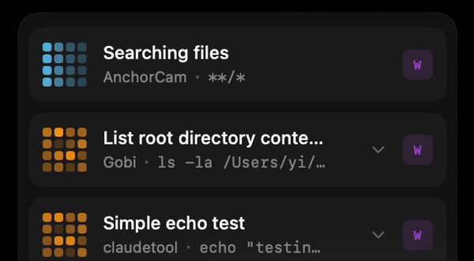

<p align="center">
  
</p>

<h1 align="center">Claude Glance</h1>

<p align="center">
  <strong>Multi-terminal Claude Code Status HUD for macOS</strong>
</p>

<p align="center">
  <a href="https://github.com/MJYKIM99/ClaudeGlance/releases"></a>
  <a href="https://github.com/MJYKIM99/ClaudeGlance/blob/main/LICENSE"></a>
  
  
</p>

<p align="center">
  <a href="#features">Features</a> •
  <a href="#installation">Installation</a> •
  <a href="#usage">Usage</a> •
  <a href="#faq">FAQ</a> •
  <a href="#中文说明">中文</a>
</p>

<p align="center">
  <code>🔒 Local-only</code> • <code>📡 No telemetry</code> • <code>🚫 No data upload</code>
</p>

<p align="center">
  
</p>

---

A native macOS application that provides a real-time floating HUD (Heads-Up Display) to monitor multiple Claude Code terminal sessions simultaneously.

## Features

- **Multi-Terminal Tracking** - Monitor multiple Claude Code sessions at once
- **Real-time Status Display** - See if Claude is reading, writing, thinking, or waiting
- **Pixel Art Animations** - Beautiful 4x4 pixel grid with unique animations for each state
- **Auto-Install Hooks** - Hook scripts are bundled and automatically configured on first launch
- **Service Status Monitoring** - Built-in service health indicator in menu bar
- **High Contrast Display** - Optimized for both light and dark desktop backgrounds
- **Fluid Window** - Automatically scales based on active session count
- **Always On Top** - Floating window stays visible above all other windows
- **Menu Bar Integration** - Quick access through the menu bar icon
- **Today's Statistics** - Track tool calls and sessions count

## Status Indicators

| Status | Color | Animation |
|--------|-------|-----------|
| Reading | 🔵 Cyan | Horizontal wave flow |
| Thinking | 🟠 Orange | Fast random flicker |
| Writing | 🟣 Purple | Top-to-bottom fill |
| Waiting for Input | 🟡 Yellow | Pulse breathing |
| Completed | 🟢 Green | Checkmark pattern |
| Error | 🔴 Red | X blink |

## Installation

### Option 1: Download DMG (Recommended)

1. Download the latest `ClaudeGlance.dmg` from [Releases](https://github.com/MJYKIM99/ClaudeGlance/releases)
2. Open the DMG and drag `ClaudeGlance.app` to Applications
3. Launch the app - hooks will be **automatically installed** on first run

### Option 2: Build from Source

```bash
git clone https://github.com/MJYKIM99/ClaudeGlance.git
cd ClaudeGlance
xcodebuild -scheme ClaudeGlance -configuration Release
```

The built app will be at:
```
~/Library/Developer/Xcode/DerivedData/ClaudeGlance-*/Build/Products/Release/ClaudeGlance.app
```

### What Gets Auto-Installed

When you first launch ClaudeGlance, it automatically:

1. Copies the hook script to `~/.claude/hooks/claude-glance-reporter.sh`
2. Sets executable permissions (`chmod +x`)
3. Updates `~/.claude/settings.json` with hook configuration

No manual setup required!

## Usage

1. Launch ClaudeGlance.app
2. A grid icon (···) will appear in your menu bar
3. Start using Claude Code in any terminal
4. The HUD will automatically display session status

### Menu Bar Options

| Option | Description |
|--------|-------------|
| Service Status | Shows if the IPC server is running |
| Show/Hide HUD | Toggle the floating window |
| Active Sessions | Live count of monitored sessions |
| Today's Stats | Tool calls and sessions count |
| Restart Service | Restart the IPC server if needed |
| Settings | Configure appearance and behavior |

## Manual Hook Configuration

If automatic installation fails, manually configure `~/.claude/settings.json`:

```json
{
  "hooks": {
    "PreToolUse": [
      {
        "matcher": "*",
        "hooks": [
          {
            "type": "command",
            "command": "~/.claude/hooks/claude-glance-reporter.sh PreToolUse"
          }
        ]
      }
    ],
    "PostToolUse": [
      {
        "matcher": "*",
        "hooks": [
          {
            "type": "command",
            "command": "~/.claude/hooks/claude-glance-reporter.sh PostToolUse"
          }
        ]
      }
    ],
    "Notification": [
      {
        "matcher": "*",
        "hooks": [
          {
            "type": "command",
            "command": "~/.claude/hooks/claude-glance-reporter.sh Notification"
          }
        ]
      }
    ],
    "Stop": [
      {
        "matcher": "*",
        "hooks": [
          {
            "type": "command",
            "command": "~/.claude/hooks/claude-glance-reporter.sh Stop"
          }
        ]
      }
    ]
  }
}
```

## Architecture

```
ClaudeGlance/
├── ClaudeGlanceApp.swift    # App entry + AppDelegate
├── Models/
│   └── SessionState.swift   # Session state model
├── Services/
│   ├── IPCServer.swift      # Unix Socket + HTTP server
│   └── SessionManager.swift # Multi-session management
├── Views/
│   ├── HUDWindowController.swift  # Floating window controller
│   ├── SessionCard.swift          # Session card
│   ├── PixelSpinner.swift         # Pixel animation
│   └── CodeRainEffect.swift       # Code rain effect
└── Scripts/
    ├── install.sh                 # Installation script
    └── claude-glance-reporter.sh  # Hook reporter script (bundled)
```

## Communication Protocol

The HUD receives JSON messages via Unix Socket (`/tmp/claude-glance.sock`) or HTTP (`localhost:19847`):

```json
{
  "session_id": "abc123",
  "terminal": "iTerm2",
  "project": "my-project",
  "cwd": "/path/to/project",
  "event": "PreToolUse",
  "data": {
    "tool": "Read",
    "tool_input": {
      "file_path": "/path/to/file.swift"
    }
  }
}
```

## Requirements

- macOS 15.0+
- Xcode 15.0+ (for building from source)
- Claude Code CLI (tested with hooks API)

## Uninstall

To completely remove Claude Glance:

```bash
# Remove hook script
rm ~/.claude/hooks/claude-glance-reporter.sh

# Remove app
rm -rf /Applications/ClaudeGlance.app

# Manually remove hooks from ~/.claude/settings.json
```

## FAQ

### Do I need to manually install hooks anymore?

**No!** As of v1.1, hooks are automatically installed when you first launch the app.

### Why does Claude Glance need hooks?

Claude Glance uses Claude Code's hooks API to receive real-time status updates. The hooks notify the HUD when Claude starts/finishes tool operations.

### Which terminals are supported?

Any terminal that runs Claude Code CLI: Terminal.app, iTerm2, Warp, VS Code terminal, Cursor, etc.

### Why is the HUD not showing any sessions?

1. Make sure ClaudeGlance.app is running (check for grid icon in menu bar)
2. Check menu bar: "Service: Running" should be shown
3. Verify hooks are installed: check `~/.claude/settings.json`
4. Check if the socket exists: `ls /tmp/claude-glance.sock`
5. Try restarting Claude Code session

### The HUD text is hard to read on light backgrounds

The HUD uses a high-contrast dark background that works on both light and dark desktops. If you're still having issues, try adjusting your display settings or use a darker desktop wallpaper.

### Is my data uploaded anywhere?

**No.** Claude Glance runs entirely locally:
- Only listens on `localhost:19847` and Unix socket `/tmp/claude-glance.sock`
- No analytics or telemetry SDKs included
- No network requests to external servers
- All data stays on your machine

### What does the menu bar icon mean?

| Icon | Meaning |
|------|---------|
| ●●● (3x3 grid) | Service running normally |
| ⚠️ | Service error - try "Restart Service" |

## License

MIT License - see [LICENSE](LICENSE) for details.

## Author

Created by **Kim**

---

# 中文说明

<p align="center">
  <strong>macOS 多终端 Claude Code 状态悬浮窗</strong>
</p>

一个 macOS 原生应用，用于实时显示多个 Claude Code 终端实例的运行状态。

## 特性

- **多终端追踪** - 同时监控多个 Claude Code 会话
- **实时状态显示** - 查看 Claude 正在读取、写入、思考还是等待
- **像素艺术动画** - 4x4 像素网格，不同状态展示不同动画效果
- **自动安装 Hooks** - 首次启动时自动配置 hook 脚本，无需手动设置
- **服务状态监控** - 菜单栏显示服务健康状态
- **高对比度显示** - 优化背景对比度，支持浅色和深色桌面
- **流体窗口** - 根据活动会话数量自动伸缩
- **始终置顶** - 悬浮窗口不会被其他窗口遮挡
- **菜单栏集成** - 通过菜单栏图标快速控制
- **今日统计** - 追踪工具调用次数和会话数量

## 状态指示

| 状态 | 颜色 | 动画 |
|------|------|------|
| 读取中 | 🔵 青色 | 水平波浪流动 |
| 思考中 | 🟠 橙色 | 快速随机闪烁 |
| 写入中 | 🟣 紫色 | 从上到下填充 |
| 等待输入 | 🟡 黄色 | 脉冲呼吸 |
| 完成 | 🟢 绿色 | 对勾图案 |
| 错误 | 🔴 红色 | X 闪烁 |

## 安装

### 方式一：下载 DMG（推荐）

1. 从 [Releases](https://github.com/MJYKIM99/ClaudeGlance/releases) 下载最新的 `ClaudeGlance.dmg`
2. 打开 DMG，将 `ClaudeGlance.app` 拖到"应用程序"文件夹
3. 启动应用 —— hooks 会**自动安装**，无需手动配置

### 方式二：从源码构建

```bash
git clone https://github.com/MJYKIM99/ClaudeGlance.git
cd ClaudeGlance
xcodebuild -scheme ClaudeGlance -configuration Release
```

构建后的应用位于：
```
~/Library/Developer/Xcode/DerivedData/ClaudeGlance-*/Build/Products/Release/ClaudeGlance.app
```

### 自动安装内容

首次启动 ClaudeGlance 时，它会自动：

1. 将 hook 脚本复制到 `~/.claude/hooks/claude-glance-reporter.sh`
2. 设置可执行权限 (`chmod +x`)
3. 更新 `~/.claude/settings.json` 中的 hook 配置

完全无需手动设置！

## 使用方法

1. 启动 ClaudeGlance.app
2. 菜单栏会出现九宫格图标 (···)
3. 在任意终端中使用 Claude Code
4. HUD 会自动显示会话状态

### 菜单栏选项

| 选项 | 说明 |
|------|------|
| 服务状态 | 显示 IPC 服务器是否运行 |
| 显示/隐藏 HUD | 切换悬浮窗口 |
| 活动会话 | 当前监控的会话数量 |
| 今日统计 | 工具调用和会话计数 |
| 重启服务 | 需要时重启 IPC 服务器 |
| 设置 | 配置外观和行为 |

## 系统要求

- macOS 15.0+
- Xcode 15.0+（从源码构建时需要）
- Claude Code CLI

## 卸载

完全移除 Claude Glance：

```bash
# 删除 hook 脚本
rm ~/.claude/hooks/claude-glance-reporter.sh

# 删除应用
rm -rf /Applications/ClaudeGlance.app

# 手动从 ~/.claude/settings.json 中移除 hooks
```

## 许可证

MIT 许可证 - 详见 [LICENSE](LICENSE)

## 作者

**Kim** 制作
